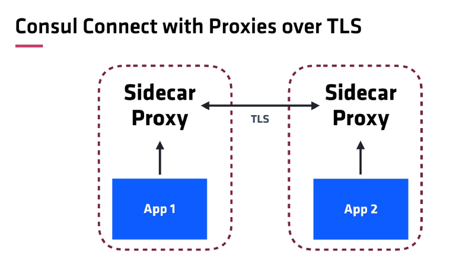

# Service Mesh with Consul and Envoy


### Summary

* This project demonstrates how Consul connect services to each other via sidecar proxies.
* This project is based on Consul tutorial in https://learn.hashicorp.com/tutorials/consul/get-started-service-networking?in=consul/getting-started. The difference is that Envoy is used as the proxy instead of the default Proxy.


### Diagram




### Usage

* You need to first download and install Consul and Envoy. Add the executables in your path so that `consul` and `envoy` commands can be run anywhere.
* You need to have unix or linux environment to execute commands like `socat` or `nc`.


### Prerequisite

* You need some knowledge on Consul and Envoy to understand this. Go through Consul tutorials in Hashicorp homepage to have some background information.


### Steps

* Start `socat` service

```
socat -v tcp-l:8181,fork exec:"/bin/cat"
```

* Write the service and proxy for socat service(i.e., /consul.d/socat.json).
* Write the dependent service and proxy(i.e., /consul.d/web.json).
  * sidecar_service stanza creates a proxy that listens on port 9191 and establish mTLS connections to socat sidecar proxy. The traffic that goes to port 9191 will be encrypted and sent over to the sidecar proxy for the socat service. The traffic will be decrypted by socat's proxy and sent over to socat on localhost:8181.

* Run consul in dev mode with node name "machine" using configs  in consul.d directory. This will register two services.

```
consul agent -dev -config-dir=./consul.d -node=machine
```

* Run sidecar proxy for "web" service. We are using envoy as the proxy.

```
consul connect envoy -sidecar-for web -admin-bind localhost:19000
```

* Run sidecar proxy for "socat" service. -admin-bind switch was used to avoid port collision with the previous side car.

```
consul connect envoy -sidecar-for socat -admin-bind localhost:19001
```

* Now check that service is accessible via sidecar proxy.

```
nc 127.0.0.1 9191
Hello via Envoy
Hello via Envoy
```


